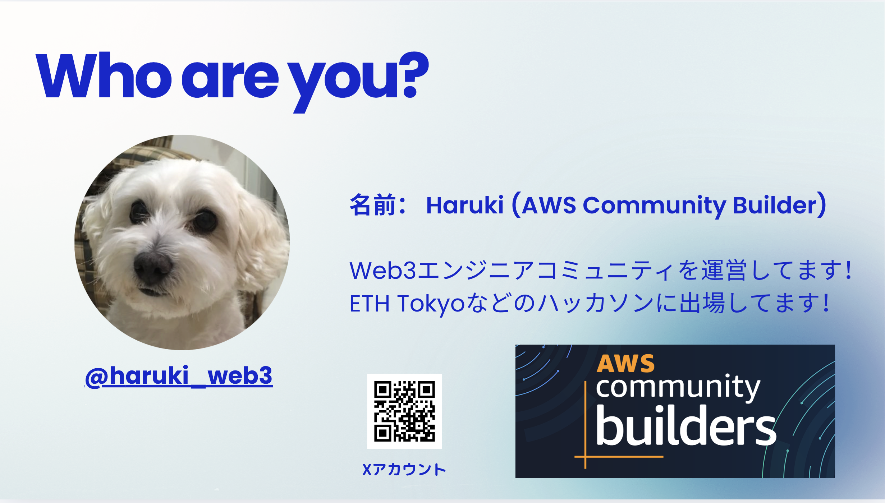

<!-- _class: title -->

# Mantle上でのオンチェーンAI Agent 開発

2026年6月3日 ｜ AI Meets Crypto — Mantle Tokyo Meetup
<strong>Haruki</strong> — AWS Community Builder (AI Engineering) / Web3 Engineer

---



---

## アジェンダ

<div class="columns" style="margin-top:8px;">
<div>

<div class="steps">
<div class="step">プロローグ: RealClaw × Mantle とは</div>
<div class="step">オンチェーンAI Agentに必要な構成要素</div>
<div class="step">オンチェーンAI Agentのシステム構成例</div>
<div class="step">AWSを使ったAI Agent実装のサービス選定</div>
<div class="step">実際に作成したAI Agent — フレームワーク・ライブラリ</div>
<div class="step">実装した機能一覧 / 処理の流れ</div>
<div class="step">まとめ — ハッカソンへの活かし方</div>
</div>

</div>
<div>

<div class="card accent" style="margin-top: 8px;">
💡 <strong>Today's Goal</strong>

MantleL2上でオンチェーンAI Agentを<br>
<strong>イマスグ自分で作れる</strong>ようになる
</div>

<div class="card warn" style="margin-top: 10px;">
🚀 <strong>Mantle Turing Test Hackathon 2026</strong><br>
<span style="font-size:0.82em;">賞金総額 $100K | 締切 6/15 | 全オンライン</span>
</div>

<div class="highlight" style="margin-top: 10px; font-size: 0.85em;">
資料: <strong>github.com/harukitosa/mantle-agent</strong>
</div>

</div>
</div>

---

## RealClaw × Mantle — AI Trading Agentプラットフォーム

<div class="columns" style="margin-top: 10px;">
<div>

### RealClaw とは

- <strong>Byreal が Mantle 上に構築</strong>したAI Agent取引プラットフォーム
- AIエージェントがオンチェーンで自律的に<strong>DeFi戦略を実行</strong>
- すべての意思決定が<strong>Mantleチェーン上に永続記録</strong>される
- Mantle Turing Test Hackathon <strong>Phase 1 (ClawHack)</strong> の舞台

### 評価指標
- 取引量（Trading Volume）
- 投資収益率（ROI）

</div>
<div>

<div class="card accent">

### 🏆 Turing Test Hackathon 2026
<strong>Phase 1: ClawHack</strong> — $20,000
<span style="font-size:0.82em;">AI AgentがMantleのDeFiエコシステム（Merchant Moe / Agni / Fluxion）で戦略実行</span>

</div>

<div class="card warn" style="margin-top: 10px;">

### 🎯 今日のデモの位置づけ
RealClawの<strong>基盤となるAI Agentインフラ</strong>を
Mastra + AWS で構築する方法を実演

</div>

<div class="highlight" style="margin-top: 10px; font-size:0.85em;">
⛓️ Mantle L2: Chain ID 5000 ｜ Gas Token: <strong>MNT</strong>
</div>

</div>
</div>

---

## 4つの専門スキルが戦略を担うノンカストディアル型DeFiエージェント

<div class="columns" style="margin-top: 10px;">
<div>

### 🎭 4つのプリセット戦略

<div class="card accent" style="margin-bottom: 7px;">
🛡️ <strong>SteadyClaw</strong> <span style="font-size:0.78em;color:#94A3B8;">— 低リスク</span><br>
<span style="font-size:0.8em;color:#94A3B8;">安定したUSD利回り。ステーブルコイン中心の運用</span>
</div>
<div class="card blue" style="margin-bottom: 7px;">
📈 <strong>TradFiClaw</strong> <span style="font-size:0.78em;color:#94A3B8;">— 低リスク</span><br>
<span style="font-size:0.8em;color:#94A3B8;">オンチェーンでRWAや株式トークンへ投資</span>
</div>
<div class="card warn" style="margin-bottom: 7px;">
🎯 <strong>SniperClaw</strong> <span style="font-size:0.78em;color:#94A3B8;">— 中リスク</span><br>
<span style="font-size:0.8em;color:#94A3B8;">DCA（定期積立）で暗号資産を自動購入</span>
</div>
<div class="card danger">
🔴 <strong>CopyClaw</strong> <span style="font-size:0.78em;color:#94A3B8;">— 高リスク</span><br>
<span style="font-size:0.8em;color:#94A3B8;">トップトレーダーの戦略をリアルタイムコピー</span>
</div>

</div>
<div>

### ⚙️ 動作の流れ

<div class="steps" style="font-size:0.88em;">
<div class="step"><div>Telegramでメッセージを送信<br><span style="font-size:0.82em;color:#94A3B8;">"USDCの利回りを増やして" など自然言語でOK</span></div></div>
<div class="step"><div>AIが意図を解釈し適切なスキルを選択</div></div>
<div class="step"><div>Privyウォレットが自動署名<br><span style="font-size:0.82em;color:#94A3B8;">秘密鍵はRealClawに渡らないノンカストディアル設計</span></div></div>
<div class="step"><div>スキルがMantle上で自動実行<br><span style="font-size:0.82em;color:#94A3B8;">Agni / Merchant Moe / Fluxion に接続</span></div></div>
</div>

<div class="highlight" style="margin-top: 10px; font-size:0.85em;">
🆓 ベータ版: 2,000クレジット（$20相当）無料付与<br>
⏱️ セットアップ10分以内 ｜ Telegram + USDCだけで開始
</div>

</div>
</div>

---

<!-- _class: section -->

## 01 — オンチェーンAI Agentに<br>必要な構成要素

オンチェーンAIエージェントを構成する8つの要素

---

## オンチェーンAI Agentは8つのコンポーネントで構成される

<div class="columns col-3" style="margin-top: 6px; gap: 14px;">
<div class="card accent">

### 🧠 LLM
<strong>推論エンジン</strong><br>
<span style="font-size:0.8em;color:#94A3B8;">GPT-4o / Gemini / Claude</span>

</div>
<div class="card accent">

### 🔧 Tool Calling
<strong>外部アクション</strong><br>
<span style="font-size:0.8em;color:#94A3B8;">Function / MCP Tools</span>

</div>
<div class="card accent">

### 💾 Memory
<strong>記憶・文脈保持</strong><br>
<span style="font-size:0.8em;color:#94A3B8;">Short-term / Long-term</span>

</div>
<div class="card warn">

### 🔑 Wallet / Signer
<strong>秘密鍵・署名</strong><br>
<span style="font-size:0.8em;color:#94A3B8;">EOA / AA Wallet</span>

</div>
<div class="card warn">

### ⛓️ Chain Connector
<strong>ブロックチェーン接続</strong><br>
<span style="font-size:0.8em;color:#94A3B8;">viem / ethers.js / RPC</span>

</div>
<div class="card warn">

### 🛡️ Risk Evaluator
<strong>安全性チェック</strong><br>
<span style="font-size:0.8em;color:#94A3B8;">Slippage / Allowance</span>

</div>
<div class="card blue">

### 🎯 Agent Framework
<strong>オーケストレーション</strong><br>
<span style="font-size:0.8em;color:#94A3B8;">Mastra / LangGraph</span>

</div>
<div class="card blue">

### 🌐 API / UI Layer
<strong>ユーザーインターフェース</strong><br>
<span style="font-size:0.8em;color:#94A3B8;">Next.js / REST / SDK</span>

</div>
</div>

---

## 「読み取り専用原則」が安全なオンチェーンAgentの基盤

<div class="columns" style="margin-top: 10px;">
<div>

### なぜ読み取り専用が重要か

- <strong>秘密鍵をAIに持たせると危険</strong>
  - LLMハルシネーションによる誤操作
  - プロンプトインジェクション攻撃
  - 不可逆なオンチェーン操作

- <strong>外部署名者へのハンドオフ</strong>
  - AIは「提案」、人間が「承認」
  - *What You See Is What You Sign (WYSIWYS)*

</div>
<div>

<div class="card danger" style="margin-bottom: 10px;">

### ❌ やってはいけないこと
AIエージェントにPRIVATE KEYを<br>直接渡して自動実行させる

</div>
<div class="card success">

### ✅ 安全なパターン
<strong>シミュレーション → リスク評価</strong><br>
→ WYSIWYS確認 → 外部ウォレットで署名

</div>

</div>
</div>

<div class="highlight">
🔒 AI Agentの設計原則：「提案はAI、実行は人間（または検証済み自動署名）」
</div>

---

<!-- _class: section -->

## 02 — オンチェーンAI Agent<br>のシステム構成例

Mantle上で動くエージェントのアーキテクチャ

---

## Next.js + Mastra + AWS Lambda でMantleに繋がるAgentを構築

<div style="margin-top: 10px;">
<div class="columns col-3" style="gap: 12px; align-items: center;">

<div>
<div class="arch-box green">👤 ユーザー</div>
<div class="arch-arrow">↓</div>
<div class="arch-box">Next.js UI<br><span style="font-size:0.8em;color:#94A3B8;">Chat Interface</span></div>
<div class="arch-arrow">↓</div>
<div class="arch-box">API Layer<br><span style="font-size:0.8em;color:#94A3B8;">Next.js Route Handler</span></div>
</div>

<div>
<div class="arch-box purple">🤖 Mastra Agent<br><span style="font-size:0.8em;">オーケストレーター</span></div>
<div class="arch-arrow">↕</div>
<div class="arch-box">LLM<br><span style="font-size:0.8em;color:#94A3B8;">Gemini Flash</span></div>
<div class="arch-arrow">↕</div>
<div class="arch-box">Memory<br><span style="font-size:0.8em;color:#94A3B8;">LibSQL (Thread)</span></div>
</div>

<div>
<div class="arch-box green">⛓️ Mantle RPC<br><span style="font-size:0.8em;">Chain ID: 5000</span></div>
<div class="arch-arrow">↑ viem</div>
<div class="arch-box">Tools<br><span style="font-size:0.8em;color:#94A3B8;">10+ Onchain Tools</span></div>
<div class="arch-arrow">↑</div>
<div class="arch-box blue">AWS Lambda<br><span style="font-size:0.8em;color:#94A3B8;">Serverless Runtime</span></div>
</div>

</div>

<div style="margin-top: 12px;" class="highlight">
💡 ユーザーの自然言語 → Agent判断 → Toolsがオンチェーン情報を取得 → 自然言語で回答
</div>
</div>

---

## AgentはReAct パターンで「考える → 行動する → 観察する」を繰り返す

<div class="columns" style="margin-top: 8px;">
<div>

<div class="steps">
<div class="step"><strong>Intent Recognition</strong><br><span style="font-size:0.82em;color:#94A3B8;">ユーザーの意図をLLMが解析</span></div>
<div class="step"><strong>Tool Selection</strong><br><span style="font-size:0.82em;color:#94A3B8;">最適なツール（複数可）を選択</span></div>
<div class="step"><strong>Risk Pre-check</strong><br><span style="font-size:0.82em;color:#94A3B8;">スリッページ・アドレス・ガスを検証</span></div>
<div class="step"><strong>Simulation</strong><br><span style="font-size:0.82em;color:#94A3B8;">Tenderly APIでステート差分を確認</span></div>
<div class="step"><strong>WYSIWYS Response</strong><br><span style="font-size:0.82em;color:#94A3B8;">「何が起きるか」を明示して提示</span></div>
</div>

</div>
<div>

<div class="card accent">
### 読み取り系ツール
`getWalletBalance` / `getSwapQuote`<br>
`resolveContractAddress` / `debugRpcError`<br>
`queryHistoricalData`
</div>

<div class="card warn" style="margin-top: 10px;">
### 検証・シミュレーション系
`evaluateTransactionRisk`<br>
`simulateTransaction`<br>
`validateContractArchitecture`
</div>

<div class="card success" style="margin-top: 10px;">
### 書き込み系 (注意)
外部署名者へのパッケージ生成のみ<br>
`prepareDeploymentPackage`
</div>

</div>
</div>

---

<!-- _class: section -->

## 03 — AWSを使ったAI Agent<br>実装のサービス選定

クラウドネイティブなAgentインフラの設計

---

## AWS × AI Agent — レイヤー別サービス選定の最適解

<div class="columns col-3" style="margin-top: 10px; gap: 14px;">

<div>
<div class="arch-box blue" style="margin-bottom: 8px; font-size:0.88em;">☁️ 実行環境</div>

<div class="card blue">
<strong>AWS Lambda</strong> (ARM64)<br>
<span style="font-size:0.8em;color:#94A3B8;">サーバーレス・コスト最小化<br>Dockerイメージで依存関係を完全封結</span>
</div>

<div class="card blue" style="margin-top: 8px;">
<strong>Lambda Function URL</strong><br>
<span style="font-size:0.8em;color:#94A3B8;">API GW不要でストリーミング対応<br>レスポンスコスト削減</span>
</div>
</div>

<div>
<div class="arch-box green" style="margin-bottom: 8px; font-size:0.88em;">🔒 機密管理 / 観測</div>

<div class="card accent">
<strong>SSM Parameter Store</strong><br>
<span style="font-size:0.8em;color:#94A3B8;">APIキーを暗号化管理<br>CDKで自動登録・ローテーション</span>
</div>

<div class="card accent" style="margin-top: 8px;">
<strong>CloudWatch Logs</strong><br>
<span style="font-size:0.8em;color:#94A3B8;">構造化ログ・アラート<br>Agentの思考トレースを可視化</span>
</div>
</div>

<div>
<div class="arch-box purple" style="margin-bottom: 8px; font-size:0.88em;">🤖 AI / スケールアップ</div>

<div class="card warn">
<strong>Amazon Bedrock</strong><br>
<span style="font-size:0.8em;color:#94A3B8;">マネージドLLM呼び出し<br>Claude 3.5 / Nova Pro対応</span>
</div>

<div class="card warn" style="margin-top: 8px;">
<strong>DynamoDB + DAX</strong><br>
<span style="font-size:0.8em;color:#94A3B8;">Agent Memory永続化<br>高可用性・スケール対応</span>
</div>
</div>

</div>

---

## Lambda + SSM + Function URL が最小コストで最大の効果を出す

<div class="columns" style="margin-top: 8px;">
<div>

### 今回の構成（実装済み）

<div class="card accent">
<strong>Lambda + ECR（Docker）</strong><br>
<span style="font-size:0.82em;">Next.js App + Mastra を一つのコンテナに。Lambda Web Adapterでストリーミング対応</span>
</div>

<div class="card accent" style="margin-top: 8px;">
<strong>SSM Parameter Store</strong><br>
<span style="font-size:0.82em;">GOOGLE_AI_KEY / LIBSQL_URL / Tenderly APIキーを安全に管理。CDKで自動登録</span>
</div>

<div class="card accent" style="margin-top: 8px;">
<strong>Lambda Function URL</strong><br>
<span style="font-size:0.82em;">API Gatewayなしでストリーミングレスポンスを直接公開（コスト削減）</span>
</div>

</div>
<div>

### スケールアップ時の推奨構成

<div class="card warn">
<strong>Amazon Bedrock</strong><br>
<span style="font-size:0.82em;">LLMをAWS管理に移行。Claude 3.5 / Nova ProをBedrock経由で呼び出し。プロバイダーロック回避</span>
</div>

<div class="card warn" style="margin-top: 8px;">
<strong>DynamoDB + DAX</strong><br>
<span style="font-size:0.82em;">Agent Memoryの永続化。Thread IDベースでスケール。LibSQLから移行で高可用性</span>
</div>

<div class="card warn" style="margin-top: 8px;">
<strong>EventBridge + SQS</strong><br>
<span style="font-size:0.82em;">自律型エージェントの非同期タスクキュー。オンチェーン監視→自動アクション</span>
</div>

</div>
</div>

---

## 用途に応じて3つのAWSアーキテクチャパターンを使い分ける

<div style="margin-top: 8px;" class="columns col-3">
<div>

<div class="card blue" style="text-align:center;">

### 💬 Chatbot型
<strong>Lambda + Bedrock</strong><br>
同期応答、会話メモリ
<hr style="border-color:#1E2D4A; margin: 8px 0;">
<span style="font-size:0.78em;color:#94A3B8;">今回の構成に近い<br>コスト最小・管理不要</span>

</div>

</div>
<div>

<div class="card accent" style="text-align:center;">

### 🤖 自律型Agent
<strong>ECS + SQS + DynamoDB</strong><br>
非同期・長時間タスク
<hr style="border-color:#1E2D4A; margin: 8px 0;">
<span style="font-size:0.78em;color:#94A3B8;">オンチェーン監視・<br>自動取引に最適</span>

</div>

</div>
<div>

<div class="card warn" style="text-align:center;">

### 🌐 Multi-Agent
<strong>Step Functions + Lambda</strong><br>
オーケストレーション
<hr style="border-color:#1E2D4A; margin: 8px 0;">
<span style="font-size:0.78em;color:#94A3B8;">複雑なワークフロー<br>分散協調処理</span>

</div>

</div>
</div>

<div class="highlight" style="margin-top: 14px;">
🏗️ 始めるなら：Lambda + Bedrock + DynamoDB が最速・最小コストのスタック
</div>

---

<!-- _class: section -->

## 04 — 実装紹介<br>RealClaw × Mantle AI Agent

実際に作ったものをみせます

---

## TypeScript + Mastra + viem のスタックで即座に開発開始できる

<div class="columns" style="margin-top: 8px;">
<div>

### 🎨 フロントエンド
<div class="card accent">
<table style="width:100%; border-collapse:collapse; font-size:0.88em;">
<thead><tr>
<th style="color:#00C98C; padding:6px 10px; border-bottom:1px solid #1E3A5F; text-align:left;">ライブラリ</th>
<th style="color:#00C98C; padding:6px 10px; border-bottom:1px solid #1E3A5F; text-align:left;">役割</th>
</tr></thead>
<tbody>
<tr><td style="padding:5px 10px; border-bottom:1px solid #1E2D4A;"><strong>Next.js 16</strong></td><td class="tbl-role" style="padding:5px 10px; border-bottom:1px solid #1E2D4A; color:#67E8C9;">App Router / SSR</td></tr>
<tr><td style="padding:5px 10px; border-bottom:1px solid #1E2D4A;"><strong>Tailwind CSS v4</strong></td><td class="tbl-role" style="padding:5px 10px; border-bottom:1px solid #1E2D4A; color:#67E8C9;">スタイリング</td></tr>
<tr><td style="padding:5px 10px; border-bottom:1px solid #1E2D4A;"><strong>shadcn/ui</strong></td><td class="tbl-role" style="padding:5px 10px; border-bottom:1px solid #1E2D4A; color:#67E8C9;">UIコンポーネント</td></tr>
<tr><td style="padding:5px 10px;"><strong>AI Elements</strong></td><td class="tbl-role" style="padding:5px 10px; color:#67E8C9;">Chatインターフェース</td></tr>
</tbody>
</table>
</div>

### 🤖 AIフレームワーク
<div class="card warn" style="margin-top: 8px;">
<table style="width:100%; border-collapse:collapse; font-size:0.88em;">
<thead><tr>
<th style="color:#00C98C; padding:6px 10px; border-bottom:1px solid #1E3A5F; text-align:left;">ライブラリ</th>
<th style="color:#00C98C; padding:6px 10px; border-bottom:1px solid #1E3A5F; text-align:left;">役割</th>
</tr></thead>
<tbody>
<tr><td style="padding:5px 10px; border-bottom:1px solid #1E2D4A;"><strong>Mastra</strong></td><td class="tbl-role" style="padding:5px 10px; border-bottom:1px solid #1E2D4A; color:#67E8C9;">Agent Orchestrator</td></tr>
<tr><td style="padding:5px 10px; border-bottom:1px solid #1E2D4A;"><strong>AI SDK v6</strong></td><td class="tbl-role" style="padding:5px 10px; border-bottom:1px solid #1E2D4A; color:#67E8C9;">LLMストリーミング</td></tr>
<tr><td style="padding:5px 10px;"><strong>@mastra/memory</strong></td><td class="tbl-role" style="padding:5px 10px; color:#67E8C9;">会話履歴管理</td></tr>
</tbody>
</table>
</div>

</div>
<div>

### ⛓️ ブロックチェーン
<div class="card blue">
<table style="width:100%; border-collapse:collapse; font-size:0.88em;">
<thead><tr>
<th style="color:#00C98C; padding:6px 10px; border-bottom:1px solid #1E3A5F; text-align:left;">ライブラリ</th>
<th style="color:#00C98C; padding:6px 10px; border-bottom:1px solid #1E3A5F; text-align:left;">役割</th>
</tr></thead>
<tbody>
<tr><td style="padding:5px 10px; border-bottom:1px solid #1E2D4A;"><strong>viem</strong></td><td class="tbl-role" style="padding:5px 10px; border-bottom:1px solid #1E2D4A; color:#67E8C9;">EVM型チェーン接続</td></tr>
<tr><td style="padding:5px 10px; border-bottom:1px solid #1E2D4A;"><strong>Mantle RPC</strong></td><td class="tbl-role" style="padding:5px 10px; border-bottom:1px solid #1E2D4A; color:#67E8C9;">L2ノードアクセス</td></tr>
<tr><td style="padding:5px 10px;"><strong>Tenderly API</strong></td><td class="tbl-role" style="padding:5px 10px; color:#67E8C9;">TX シミュレーション</td></tr>
</tbody>
</table>
</div>

### ☁️ インフラ
<div class="card accent" style="margin-top: 8px;">
<table style="width:100%; border-collapse:collapse; font-size:0.88em;">
<thead><tr>
<th style="color:#00C98C; padding:6px 10px; border-bottom:1px solid #1E3A5F; text-align:left;">ライブラリ</th>
<th style="color:#00C98C; padding:6px 10px; border-bottom:1px solid #1E3A5F; text-align:left;">役割</th>
</tr></thead>
<tbody>
<tr><td style="padding:5px 10px; border-bottom:1px solid #1E2D4A;"><strong>AWS CDK</strong></td><td class="tbl-role" style="padding:5px 10px; border-bottom:1px solid #1E2D4A; color:#67E8C9;">IaC（TypeScript）</td></tr>
<tr><td style="padding:5px 10px; border-bottom:1px solid #1E2D4A;"><strong>AWS Lambda</strong></td><td class="tbl-role" style="padding:5px 10px; border-bottom:1px solid #1E2D4A; color:#67E8C9;">サーバーレス実行</td></tr>
<tr><td style="padding:5px 10px; border-bottom:1px solid #1E2D4A;"><strong>LibSQL</strong></td><td class="tbl-role" style="padding:5px 10px; border-bottom:1px solid #1E2D4A; color:#67E8C9;">Agent Memory DB</td></tr>
<tr><td style="padding:5px 10px;"><strong>Biome</strong></td><td class="tbl-role" style="padding:5px 10px; color:#67E8C9;">コード品質</td></tr>
</tbody>
</table>
</div>

</div>
</div>

---

## Mantle特化の10スキルを実装 — DeFiからデプロイ支援まで全カバー

<div class="columns col-3" style="margin-top: 8px; gap: 12px;">
<div class="card accent">

### 🌐 ネットワーク情報
Chain ID / RPC / Gas Token<br>L1/L2コントラクト情報

</div>
<div class="card accent">

### 💼 ポートフォリオ分析
MNT / WMNT / USDT / USDC<br>Multicallでバランス一括取得

</div>
<div class="card accent">

### 📍 アドレスレジストリ
コントラクト名→アドレス解決<br>EIP-55チェックサム検証

</div>
<div class="card warn">

### 💱 DeFiオペレーション
Agni Finance スワップ見積<br>流動性プール情報

</div>
<div class="card warn">

### 🛡️ リスク評価
スリッページ / ガス / デッドライン<br>6項目の自動チェック

</div>
<div class="card warn">

### 🎭 TX シミュレーション
Tenderly API優先<br>WYSIWYS サマリー生成

</div>
<div class="card blue">

### 🔍 RPCデバッガー
rate limit / revert / nonce<br>エラーパターン診断

</div>
<div class="card blue">

### 📊 データインデクサー
GraphQL / SQL テンプレ<br>ウォレット・プール分析

</div>
<div class="card success">

### 📝 コントラクト開発
ERC-20/721/1155テンプレ<br>アーキテクチャ検証

</div>
<div class="card success">

### 🚀 デプロイ支援
チェックリスト生成<br>外部署名者ハンドオフ

</div>
</div>

---

<!-- _class: dark -->

## 自然言語から「安全なオンチェーン提案」まで6ステップで完結

<div class="columns" style="margin-top: 8px;">
<div style="font-size:0.9em;">

<div class="steps">
<div class="step">
<div><strong>ユーザー入力</strong><br>
<span style="font-size:0.82em;color:#94A3B8;">"MNTをUSDTに100スワップしたい"</span>
</div>
</div>
<div class="step">
<div><strong>Intent Recognition (LLM)</strong><br>
<span style="font-size:0.82em;color:#94A3B8;">スワップ意図を検出 → 適切なツールを選択</span>
</div>
</div>
<div class="step">
<div><strong>リスク評価 → evaluateTransactionRisk</strong><br>
<span style="font-size:0.82em;color:#94A3B8;">スリッページ・アドレス安全性・ガス・デッドラインを6項目チェック</span>
</div>
</div>
<div class="step">
<div><strong>スワップ見積 → getSwapQuote</strong><br>
<span style="font-size:0.82em;color:#94A3B8;">Agni QuoterV2 に eth_call → 出力量・価格影響を取得</span>
</div>
</div>
<div class="step">
<div><strong>TX シミュレーション → simulateTransaction</strong><br>
<span style="font-size:0.82em;color:#94A3B8;">Tenderly APIでステート差分確認・WYSIWYS生成</span>
</div>
</div>
<div class="step">
<div><strong>外部ウォレットへハンドオフ</strong><br>
<span style="font-size:0.82em;color:#94A3B8;">未署名パッケージを提示 → MetaMask等で署名・送信</span>
</div>
</div>
</div>

</div>
<div>

```typescript
// Mastra Agent Tool — getSwapQuote
export const getSwapQuote = createTool({
  id: "getSwapQuote",
  description: "Get swap quote from Agni QuoterV2",
  inputSchema: z.object({
    tokenIn: z.string(),
    tokenOut: z.string(),
    amountIn: z.string(),
    network: z.enum(["mainnet", "sepolia"]),
  }),
  execute: async ({ context }) => {
    const client = createPublicClient({
      chain: mantle,
      transport: http(RPC_URL),
    });
    // Agni QuoterV2 への eth_call
    const quote = await client.readContract({
      address: QUOTER_V2_ADDRESS,
      abi: QuoterV2ABI,
      functionName: "quoteExactInputSingle",
      args: [{ tokenIn, tokenOut, amountIn, fee }],
    });
    return { amountOut: quote[0], priceImpact };
  },
});
```

</div>
</div>

---

<!-- _class: section -->

## 05 — まとめ

オンチェーンAI Agent開発のポイント

---

## ビルダーに必要な3つのエッセンスに絞り込める

<div class="columns col-3" style="margin-top: 16px;">
<div style="text-align:center; padding: 16px 8px;">
<span class="number">10</span>
<p style="color: var(--accent); font-weight:700; margin: 6px 0 4px;">Onchain Tools</p>
<p style="font-size:0.78em; color:#94A3B8;">DeFiからデプロイまで<br>全カバーのツールセット</p>
</div>
<div style="text-align:center; padding: 16px 8px;">
<span class="number warm">100%</span>
<p style="color: var(--accent-warm); font-weight:700; margin: 6px 0 4px;">Read-Only Safe</p>
<p style="font-size:0.78em; color:#94A3B8;">対応全ツールが<br>秘密鍵不要設計</p>
</div>
<div style="text-align:center; padding: 16px 8px;">
<span class="number blue">$0</span>
<p style="color: var(--accent-blue); font-weight:700; margin: 6px 0 4px;">Fixed Server Cost</p>
<p style="font-size:0.78em; color:#94A3B8;">AWS Lambdaによる<br>完全サーバーレス実現</p>
</div>
</div>

<div class="columns" style="margin-top: 16px;">
<div>

### ✅ 今日のキーポイント

- <strong>読み取り専用原則</strong>を守るAI設計がベストプラクティス
- <strong>Mastra × AI SDK</strong>でTypeScriptのAgent構築が即座に可能
- <strong>AWS CDK</strong>で再現性100%のインフラ管理
- Mantleは<strong>低コスト・EigenDA</strong>でAI Agentに最適なレイヤー2

</div>
<div>

<div class="card accent">

### 🏆 Mantle Turing Test Hackathon 2026
賞金総額 <strong>$100K</strong> | 締切 <strong>6月15日</strong>

<span style="font-size:0.82em;">・ AI Trading ・ AI Alpha & Data ・ AI x RWA<br>・ <strong>AI DevTools</strong> ・ <strong>Agentic Wallets</strong> ← おすすめ</span>

</div>

<div class="highlight" style="margin-top: 10px;">
🚀 今すぐ作れる！一緒に作ろう 👋
</div>

</div>
</div>

---

<!-- _class: ending -->

# ありがとうございました 🙏

## Let's Build Onchain AI Agents on Mantle!

Haruki — AWS Community Builder / Web3 Engineer

X: <strong>@haruki_web3</strong>

<br>

📣 Mantle Turing Test Hackathon 2026 — Apply by <strong>June 15</strong>
https://dorahacks.io/hackathon/mantleturingtesthackathon2026/detail
