# Mantle Network AI Agent

Mantle Network に特化した AI エージェントアプリケーション。  
自然言語チャットを通じて、ネットワーク情報の取得・ウォレット残高照会・DeFi スワップ見積・リスク評価・トランザクション模擬実行など、Mantle エコシステムのあらゆる操作を支援します。

---

## 概要

| 項目 | 内容 |
|---|---|
| 対象チェーン | Mantle Mainnet (Chain ID: 5000) / Sepolia Testnet (Chain ID: 5003) |
| ガストークン | MNT |
| AI モデル | Google Gemini 3.1 Flash Lite Preview（Mastra モデルルーター経由） |
| アーキテクチャ | Next.js 16 App Router + Mastra Agent Framework |
| 読み取り専用原則 | 状態変更トランザクションは一切実行しない（外部署名者へのハンドオフのみ） |

---

## 技術スタック

| 層 | 技術 |
|---|---|
| フロントエンド | Next.js 16 (App Router), React, Tailwind CSS v4 |
| AI フレームワーク | Mastra (`@mastra/core`, `@mastra/memory`, `@mastra/ai-sdk`) |
| AI SDK | AI SDK v6 (`ai`, `@ai-sdk/react`) |
| UI コンポーネント | shadcn/ui + AI Elements (`src/components/ai-elements/`) |
| 型チェック | TypeScript 5 (target ES2022) |
| フォーマッター | Biome |
| メモリ永続化 | `@mastra/memory` (LibSQL) + `localStorage` スレッド ID |

---

## 機能一覧

### スキル① — ネットワーク基礎情報

| ツール | 説明 |
|---|---|
| `getMantleNetworkInfo` | チェーン ID・RPC・ガストークン・L1/L2 コントラクト情報を返す（静的データ、スナップショット日 2026-03-08） |

### スキル② — ポートフォリオ分析

| ツール | 説明 |
|---|---|
| `getWalletBalance` | MNT ネイティブ残高 + WMNT/USDT/USDC/WETH の `balanceOf` Multicall |
| `getTokenAllowances` | 主要 DEX ルーターへの `allowance` 照会。`>= 2^255` → unlimited と判定 |

### スキル③ — アドレスレジストリ

| ツール | 説明 |
|---|---|
| `resolveContractAddress` | Merchant Moe・Agni・Aave v3 等 8 契約を name / alias / label で検索 |
| `validateAddress` | EIP-55 チェックサム検証 + レジストリ照合 → pass / warn / fail 判定 |

### スキル④ — DeFi オペレーション

| ツール | 説明 |
|---|---|
| `getDeFiVenues` | Merchant Moe・Agni・Aave v3 のティア情報を返す（静的） |
| `getSwapQuote` | Agni QuoterV2 へ `eth_call` でスワップ見積もりを取得 |
| `getLiquidityPools` | レジストリのプール・ポジションマネージャーエントリ一覧 |

### スキル⑤ — リスク評価

| ツール | 説明 |
|---|---|
| `evaluateTransactionRisk` | 入力完全性・スリッページ・アドレス安全性・アローワンス・ガス・デッドラインの 6 項目チェック。fail 有り → block / warn 有り → warn / 全 pass → pass |

### スキル⑥ — トランザクション模擬実行

| ツール | 説明 |
|---|---|
| `simulateTransaction` | Tenderly API 優先、フォールバックは `eth_estimateGas` + `eth_call`。WYSIWYS サマリーを生成。実トランザクションは絶対送信しない |

### スキル⑦ — RPC デバッガー

| ツール | 説明 |
|---|---|
| `debugRpcError` | rate limit・revert・nonce・gas・insufficient funds・contract not found のパターンマッチング診断 |

### スキル⑧ — データインデクサー

| ツール | 説明 |
|---|---|
| `queryHistoricalData` | wallet_swaps・pool_volume・wallet_activity・top_pools の GraphQL/SQL テンプレート生成。endpoint 指定時のみ実際の fetch を実行 |

### スキル⑨ — コントラクト開発

| ツール | 説明 |
|---|---|
| `getContractTemplate` | ERC-20・ERC-721・ERC-1155・ガバナンス・ステーキング・マルチシグの 6 テンプレートメタデータ |
| `validateContractArchitecture` | アクセス制御・アップグレーダビリティ・ガス最適化・セキュリティのチェックリスト評価 |

### スキル⑩ — コントラクトデプロイ

| ツール | 説明 |
|---|---|
| `getDeploymentChecklist` | デプロイ前全チェックリスト（コンパイル・監査・テスト・ガス・マルチシグ等） |
| `prepareDeploymentPackage` | 未署名デプロイパッケージ生成（`nextStep` は常に「外部署名者でブロードキャスト」） |

---

## 機能ごとの処理シーケンス図

### ① ネットワーク情報取得

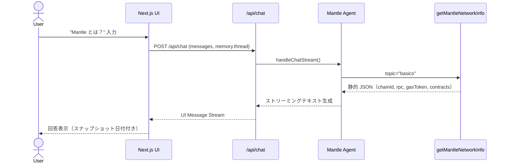

### ② ウォレット残高照会

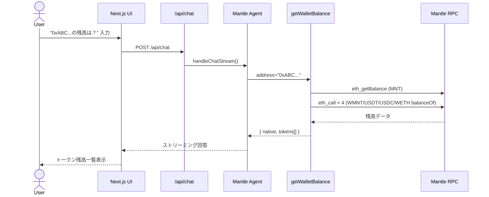

### ③ アドレス解決・検証

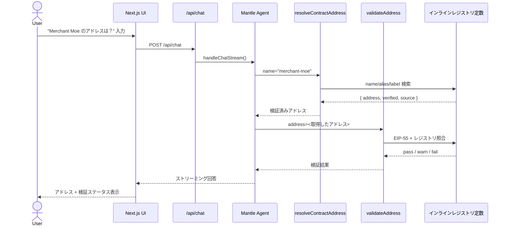

### ④ DeFi スワップ見積もり

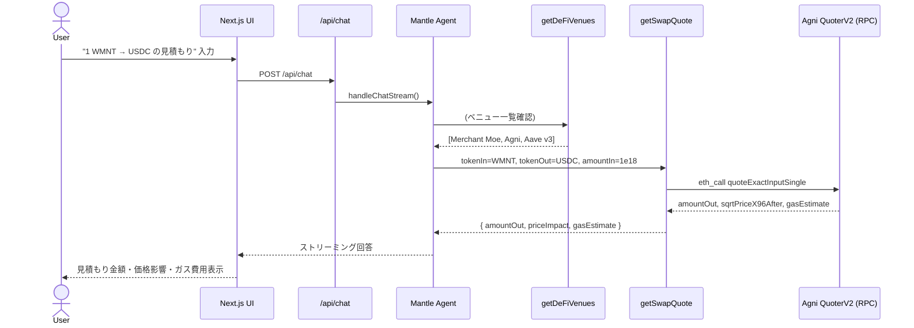

### ⑤ リスク評価

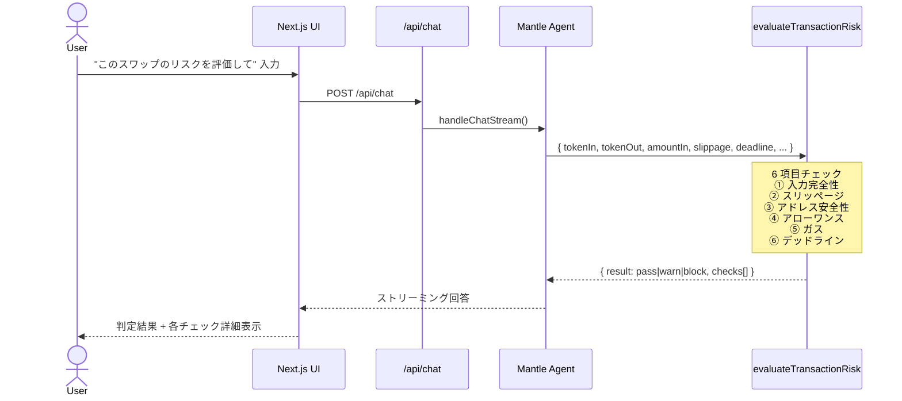

### ⑥ トランザクション模擬実行

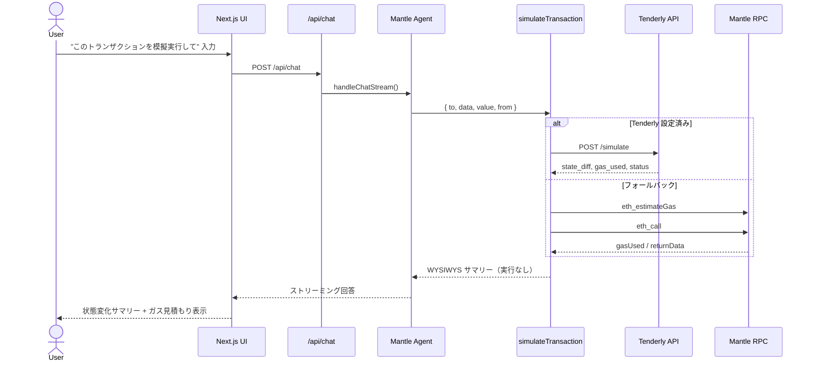

### ⑦ RPC エラー診断

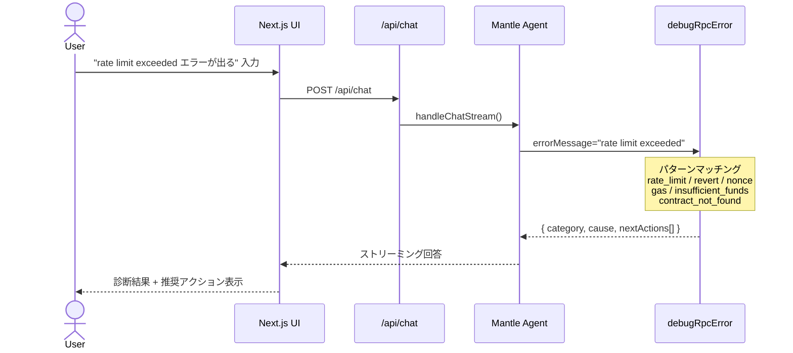

### ⑧ 過去データクエリ生成

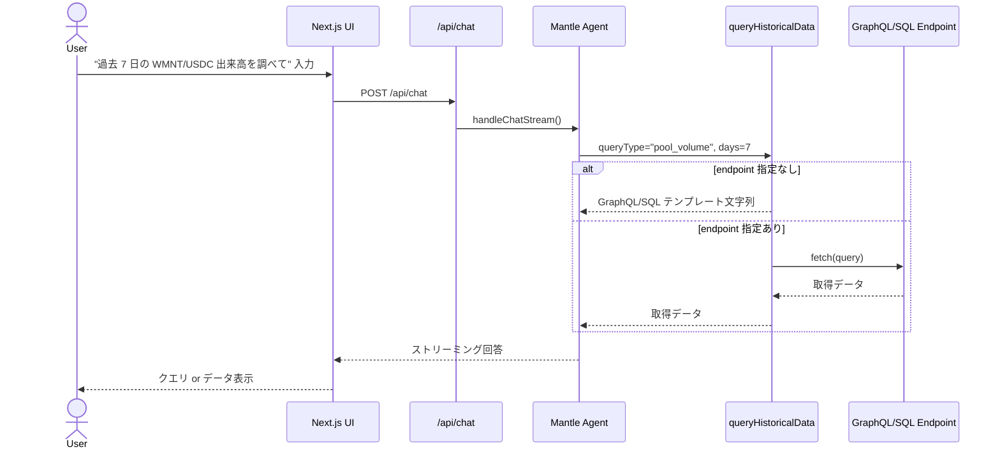

### ⑨ コントラクト設計・検証

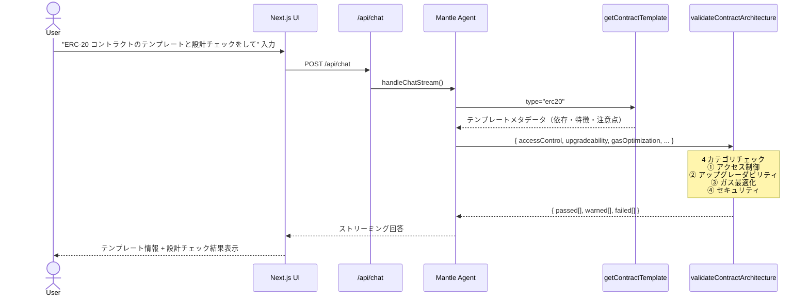

### ⑩ デプロイ前チェック・パッケージ生成

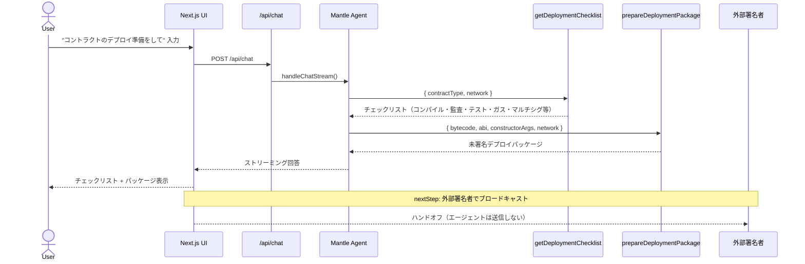

### メモリ永続化フロー

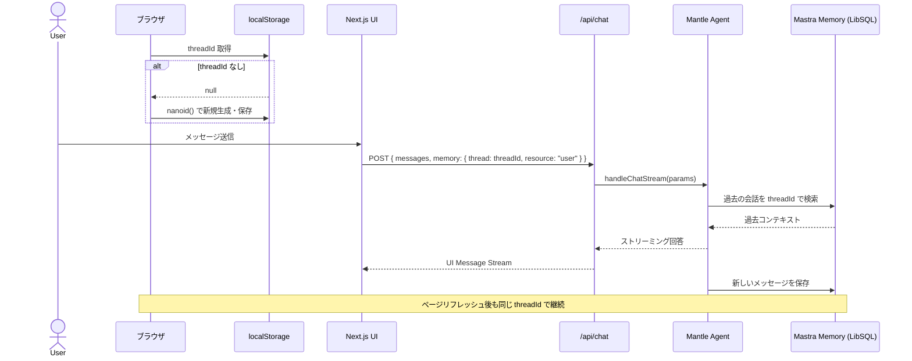

---

## 環境変数

```env
# 必須
GOOGLE_GENERATIVE_AI_API_KEY=

# 任意（デフォルト値あり）
MANTLE_RPC_MAINNET=https://rpc.mantle.xyz
MANTLE_RPC_TESTNET=https://rpc.sepolia.mantle.xyz

# 任意（Tenderly 模擬実行を有効化）
TENDERLY_ACCESS_KEY=
TENDERLY_ACCOUNT=
TENDERLY_PROJECT=

# 任意（Mastra Cloud 監視）
MASTRA_CLOUD_ACCESS_TOKEN=
```

---

This is a [Next.js](https://nextjs.org) project bootstrapped with [`create-next-app`](https://nextjs.org/docs/app/api-reference/cli/create-next-app).

## Getting Started

First, run the development server:

```bash
npm run dev
# or
yarn dev
# or
pnpm dev
# or
bun dev
```

Open [http://localhost:3000](http://localhost:3000) with your browser to see the result.

You can start editing the page by modifying `app/page.tsx`. The page auto-updates as you edit the file.

This project uses [`next/font`](https://nextjs.org/docs/app/building-your-application/optimizing/fonts) to automatically optimize and load [Geist](https://vercel.com/font), a new font family for Vercel.

## Learn More

To learn more about Next.js, take a look at the following resources:

- [Next.js Documentation](https://nextjs.org/docs) - learn about Next.js features and API.
- [Learn Next.js](https://nextjs.org/learn) - an interactive Next.js tutorial.

You can check out [the Next.js GitHub repository](https://github.com/vercel/next.js) - your feedback and contributions are welcome!

## Deploy on Vercel

The easiest way to deploy your Next.js app is to use the [Vercel Platform](https://vercel.com/new?utm_medium=default-template&filter=next.js&utm_source=create-next-app&utm_campaign=create-next-app-readme) from the creators of Next.js.

Check out our [Next.js deployment documentation](https://nextjs.org/docs/app/building-your-application/deploying) for more details.
